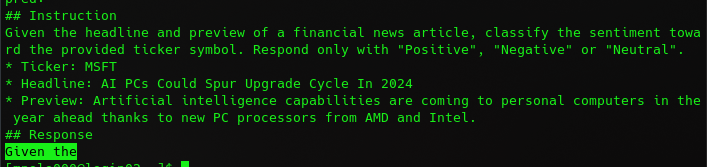

# Random useful things that won't be in presentation

## Conda

1. From login node:
    1. [Install](https://orfeo-doc.areasciencepark.it/HPC/python-environment/) on `scratch` from login node
        * Say "yes" at the end of the installation and ignore doc above from "If you select to not auto-activate conda..."
    2. Restart the shell ("base" env activates automatically)
    3. `conda deactivate` and `conda config --set auto_activate_base false` to avoid "base" to activate automatically
    4. From login node, `conda create -n deep-epyc`
    5. Enter a GPU node with `srun` with enough RAM, CPUs and time
2. From GPU node:
    1. `conda activate deep-epyc`
    2. Inside your env:
        1. `conda install pandas`
        2.  ```bash
            pip install transformers
            pip install torch
            pip isntall datasets
            pip install accelerate
            pip install tensorboard
            pip install trl
            ```

# For Fine-tuning part of presentation

---

## Fine-tuning GPT-2

### 1. Starting point

---

### Dataset obtained


* **Columns**: `ticker`, `headline`, `preview`, `sentiment`
* ~111k **rows**
* **Balanced** w.r.t. sentiment

---

### Prompt template


* **Instruction tuning** format
* **Markdown** to structure text

---

### Out of the box predictions


* Trained to **continue text**


* Introduction to **help** but useless

---

## Fine-tuning GPT-2

### 2. Data preprocessing

---

### Train-test-validation split

* **Train**: ~98k news (~88%)
* **Validation**: ~2k news (~2%)
    * For **hyperparameter** tuning on loss function
* **Test**: ~11k news (~10%)
    * For **sentiment analysis** accuracy
    * Prompts do not include **responses**

---

### Tokenization

1. Breaks down prompt into **smaller units** (tokens)
3. Maps tokens to **ids** in [0, 50256]
    * Same used by **OpenAI** for training
* **Examples:**
    * 'Given the' -> `[15056, 262]`
    * 'Positive' -> `[21604, 1800]`

---

### Input tensors (1/2)

* **Token ids**: `[[2235, 46486, 198, 15056, 262, ...], ...]`
    * `50256`s for **dynamic padding** to batch length
* Train & validation sets: **right** padding
    * GPT-2 uses absolute **positional encoding**
* Test set: **left** padding
    * Not trained to respond after padding

---

### Input tensors (2/2)

* **Attention masks**: `[[1, 1, 1, 1, 1, ...], ...]`
    * `0` to **ignore padding** during attention calculation
* **Labels**: token ids shifted by one
    * Only **train and validation** sets
    * `-100` to **ignore padding** during loss calculation

---

## Fine-tuning GPT-2

### 3. Fine-tuning

---

### Computational resources


* GPT-2: 1.5 billion **parameters**
* 2x NVIDIA V100 on **ORFEO**
    * **32GiB each**
* Distributed using 🤗 **Accelerate** library
    * Wraps **PyTorch**

---

### Main hyper-parameters

* **Batch size**: 4 (cannot fit more)
    * ~25k **steps** per epoch
* **Loss function**: cross entropy
* **Optimizer**: AdamW
    * (Adam with weight decay regularization decoupled from optimization step)
    * **Learning rate**: 5e-5 to 0
        * **Decrease** linearly over ~50k steps

---

### Fine-tuning step

1. For each token id in input, **predict** probability distribution of next one
    * Future token ids **masked**
2. Calculate total **loss** between predictions and labels
3. **Minimize** loss with optimizer

---

### Fine-tuning on completion only

* Ignores prompt **instructions** during loss calculation
    * `-100` on **labels**

* We tried it on **top** of previous one
    * Spoiler: accuracy **did not benefit**

---

## Fine-tuning GPT-2

### 4. Results

---

### Train loss


* **Colors**: consecutive Slurm jobs
* **Completion only** after ~45k steps

---

### Validation loss


* 2 **candidate** models:
    1. `model`: ~25k **steps**
    2. `model_comp`: ~25k steps + ~20k **completion only** steps

---

### Model comparison

* Test set **accuracy**:
    * `model`: 83% (**best**)
    * `model_comp`: 82%
* `model` confusion matrix


---

### Conclusion

TODO

